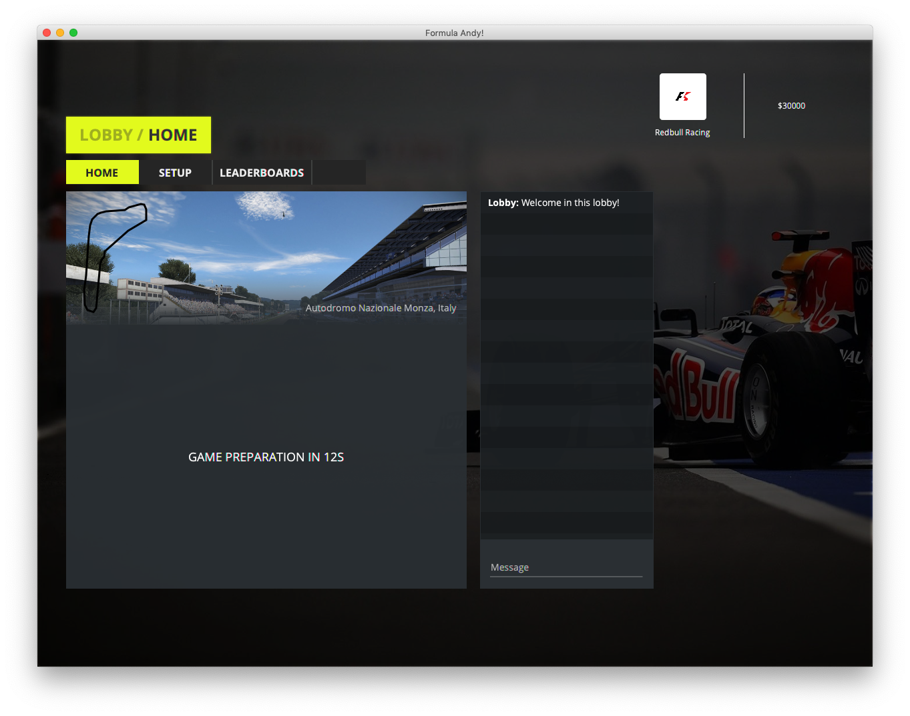

<h1 align="center">Formula Andy</h1>
<p align="center">
Formula Andy is the State of the art Formula One Manager game, open-source and
written in Java.
</p>
<p align="center">
  <a href="https://travis-ci.com/fabianishere/formula-andy">
    
  </a>
</p>


<p align="center">
	
</p>

## Getting the source
Download the source code by running the following code in your command prompt:
```sh
$ git clone https://github.com/fabianishere/formula-andy.git
```
or simply [grab](https://github.com/fabianishere/formula-andy/archive/master.zip)
a copy of the source code as a zip file.

## Building
For building the source code, we use Gradle. To run gradle, enter the following
in your command prompt:
```sh
$ ./gradlew build
```
To test the source code, run the following code in your command prompt
```
$ ./gradlew test
```

## Running
Formula Andy is a multi-player game and requires a server to run. To quickly start
a test server on `localhost`, run the following in your command prompt:

```bash
$ ./gradlew :fa-server:runTestServer
```

To run the game's frontend, simply enter the following in your command prompt:

```bash
$ ./gradlew :fa-frontend-javafx:run
```

This will open the JavaFX frontend of the game and present a login screen. The
following pre-defined users are available:

| Username     | Password |
| ------------ | -------- |
| fabianishere | test     |
| christov     | test     |

## License
The code is released under the MIT license. See the `LICENSE.txt` file.

